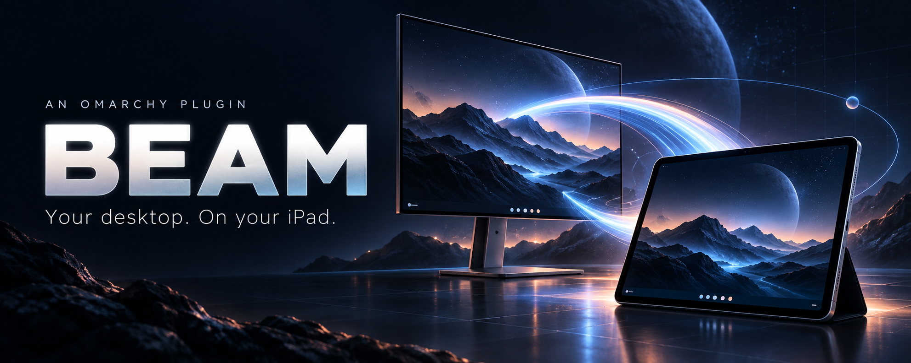
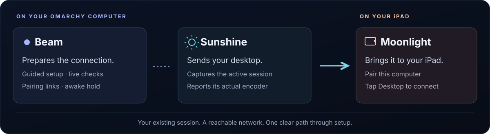
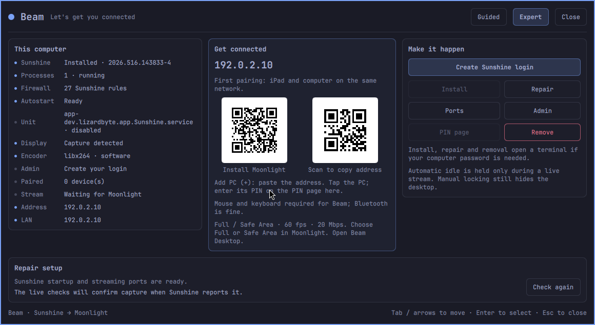
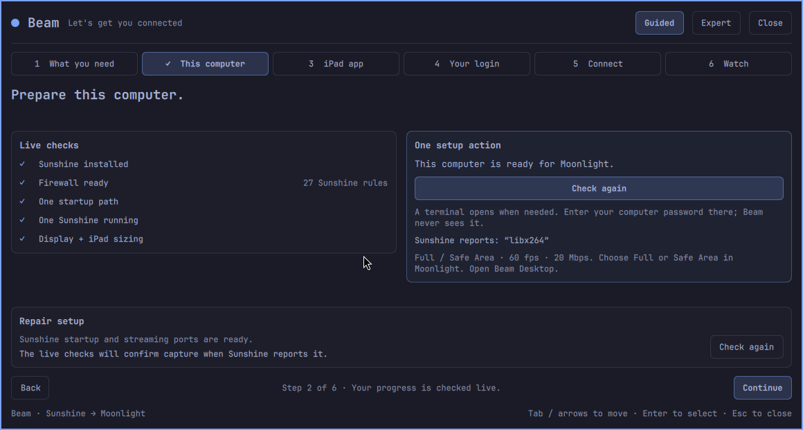
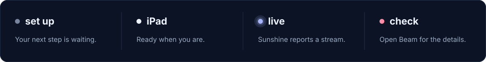

<p align="center">
  
</p>

<p align="center">
  <strong>Click the dot. Set up the stream. Take your desktop with you.</strong>
</p>

<p align="center">
  <a href="#get-started">Get started</a> ·
  <a href="#see-it-in-action">Screenshots</a> ·
  <a href="#six-steps-to-your-desktop">The walkthrough</a> ·
  <a href="#an-ipad-fit-for-an-ultrawide-desktop">iPad sizing</a> ·
  <a href="#built-and-checked">Verification</a>
</p>

Beam puts an Omarchy desktop-to-iPad setup flow right in your bar. It prepares
[**Sunshine**](https://github.com/LizardByte/Sunshine) on your computer, points you
to [**Moonlight**](https://moonlight-stream.org/) on your iPad, and keeps
the address, pairing page, and live checks together in one native panel.

**Development preview.** Clean installation, removal, layout, and awake-hold
checks have passed locally. Physical iPad pairing and streaming acceptance is
still in progress. [See exactly what has been tested.](docs/verification/README.md)

<p align="center">
  
</p>

## Small dot. Full control.

The desktop **and its sound** come through, including music playing on the host.
Video and desktop audio have been confirmed together on a physical iPad.

| Start from zero | Move like you know it |
| :--- | :--- |
| **Guided mode** breaks setup into six focused steps. Reopen Beam and land on the first unfinished one. | **Expert mode** puts status, connection details, both QR codes, and setup actions together. |
| **Scan the right app.** A QR code opens Moonlight's App Store page. A second holds your connection address. | **Read the real state.** See process count, startup, firewall, display, encoder, login, pairing, and stream status. |
| **Fit the iPad.** Moonlight supplies the requested size. Beam temporarily selects a compatible desktop mode and restores it afterward. | **Finish interrupted setup.** Repair handles the known Omarchy installer/service mismatch and duplicate startup paths. |

Every panel view is designed to fit **without scrolling**. Colors and fonts follow
your shell theme. QR codes keep their white background and quiet zone in both
dark and light themes.

## See it in action

**Expert mode: the whole connection at a glance.**

<picture>
  <source media="(prefers-color-scheme: dark)" srcset="docs/assets/beam-expert-dark.png">
  <source media="(prefers-color-scheme: light)" srcset="docs/assets/beam-expert-light.png">
  
</picture>

<p align="center">
  <a href="docs/assets/beam-expert-dark.png">View dark at full size</a> ·
  <a href="docs/assets/beam-expert-light.png">View light at full size</a>
</p>

**Guided mode: one clear next step.**

<p align="center">
  <a href="docs/assets/beam-guided.png"></a>
</p>

<sub>Native plugin captures from an isolated Omarchy VM at 1280×800. The displayed
address is a documentation fixture. The opening banner is conceptual artwork.</sub>

## Get started

Bring an **Omarchy session with a display**, an **iPad with a mouse and keyboard**,
and a network where the iPad can reach the computer. Bluetooth peripherals are
fine. Keep the desktop session unlocked.

Beam uses Omarchy's Quickshell plugin system and Python 3. Its setup action
installs Sunshine and `qrencode`. You install Moonlight on the iPad.

Install from GitHub:

```sh
omarchy plugin add https://github.com/nixfred/beam.git --enable
```

Choose a bar position when prompted. Then click the **set up** dot and let Beam
walk you through the rest. Package and firewall actions open a visible terminal
when needed, so you enter your computer password there.

<details>
<summary><strong>Developing from a local checkout?</strong></summary>

From the repository root, link Beam into your user plugin directory. These
commands assume that `nixfred.beam` has not already been installed there.

```sh
mkdir -p "$HOME/.config/omarchy/plugins"
ln -s "$PWD" "$HOME/.config/omarchy/plugins/nixfred.beam"
omarchy-shell shell rescanPlugins
omarchy plugin enable nixfred.beam --section right
```

If a code change stays cached after rescanning, use `omarchy restart shell`.

</details>

## Six steps to your desktop

| | In Beam | What you do |
| :---: | :--- | :--- |
| **01** | **What you need** | Get your iPad, mouse, and keyboard ready. |
| **02** | **This computer** | Run setup. Watch installation, ports, startup, process, and capture checks update. |
| **03** | **iPad app** | Scan the QR code for **Moonlight Game Streaming** by Diego Waxemberg. |
| **04** | **Your login** | Create your Sunshine login on its local admin page. |
| **05** | **Connect** | Add this computer in Moonlight, then enter its PIN on the linked Sunshine PIN page. |
| **06** | **Watch** | Select **Full** or **Safe Area** resolution in Moonlight, then tap **Beam Desktop**. Beam fits the desktop to the requested picture size. |

The step rail works in both directions. Your current progress is checked live.
For repeat visits, switch to **Expert** for the address, QR codes, and PIN page.

If Sunshine reports success creating your login, then shows **401 / Unauthorized**,
open **Admin** and sign in with that new Sunshine username and password. Admin
and PIN pages open in the same private browser session; keep that window open
for pairing. **Repair** also routes Sunshine's pairing notification and its
Sunshine Admin launcher to that session. This avoids extensions in the regular profile that can suppress
the login prompt, as reported in [Sunshine's troubleshooting discussion](https://github.com/orgs/LizardByte/discussions/788).

If the iPad says **Incorrect PIN** while Sunshine's web page says success,
start a fresh pairing attempt in Moonlight. Keep its PIN visible and enter those
exact four digits in Sunshine, including any leading zero. Wait for Moonlight
to confirm pairing. Sunshine 2026.516's web success means it accepted the PIN
submission, before the authenticated handshake finishes
([Sunshine source](https://github.com/LizardByte/Sunshine/blob/v2026.516.143833/src/nvhttp.cpp#L635-L680)).

Beam installs a Sunshine-only browser helper and backs up its original startup
file. The helper sends local Sunshine pages to the private session; other links
keep their normal browser behavior. Your global browser settings stay as they are.

## An iPad fit for an ultrawide desktop

A **5120×1440** desktop should not become a tiny panoramic strip on your iPad.
Beam's **Beam Desktop** app in Sunshine receives the width, height, and frame
rate requested by Moonlight before streaming begins.
Setup also adds the same sizing and recovery to Sunshine's unmodified **Desktop**
tile, so either desktop entry fits the client. Existing customized apps stay intact.
If updating an older Beam setup, quit the stream and run **Repair** once to enable
sizing on the default tile.

1. In Moonlight on the iPad, set resolution to **Full** or **Safe Area**, and
   start with **60 FPS**. Those choices use the iPad screen size; Beam cannot
   identify a disconnected iPad or override Moonlight's selected stream size.
2. Open **Beam Desktop**. Beam saves the current monitor mode, position, and
   scale, then selects a supported mode that fits within the requested size.
   An exact size wins when available; otherwise the closest aspect ratio wins.
3. Ending the stream restores the saved display layout. **Restore display**
   in Expert is also available while a sizing session is active.

For example, if a 5120×1440 monitor supports 1024×768 but cannot display an iPad's
2048×1536 request, Beam uses the supported **4:3 desktop**. Sunshine sends the
requested stream size. This fallback has less detail than native resolution;
slightly different aspect ratios may retain borders. Beam never invents a
monitor mode or stretches the desktop to claim an exact fit.

The physical monitor changes temporarily, so its local picture can look
different during streaming. For multiple monitors, choose the desired connector
in Sunshine's **Output Name** setting. Beam refuses an ambiguous selection.
After changing Moonlight's resolution, quit the old session and reopen
**Beam Desktop** so the new dimensions are supplied.

If windows and text look oversized, check Moonlight's resolution setting. A
**720p** request creates a 1280×720 desktop workspace; it does not identify the
iPad's native screen size. Choose **Full / Safe Area**, then quit and relaunch
the desktop. Beam shows both the requested size and the actual supported mode.

Existing installations: run **Repair** once to add the Beam Desktop app. Other
Sunshine apps are preserved. Keep the picture awake is enabled by default and
releases when streaming ends.

## One dot tells the story

<p align="center">
  
</p>

The live dot pulses in your theme's accent color. Open Beam when it says
**check** to see the reason. The colors above are illustrative; the actual widget
uses your active theme.

## Your session, your settings

| Setting | Default | What it changes |
| :--- | :--- | :--- |
| **Keep this session awake** | On | Holds automatic idle during a detected stream. Manual locking still hides the desktop. |
| **Show the status beside the dot** | On | Shows `set up`, `iPad`, `live`, or `check` beside the bar indicator. |
| **Refresh interval** | 5 seconds | Sets regular status polling. Beam checks every 2 seconds while streaming or making changes. |

Beam leaves Sunshine login entry to Sunshine's own page and administrator
password entry to the visible terminal. It reports the encoder Sunshine actually
found instead of guessing from the graphics hardware.

Beam expects an already reachable network. Wi-Fi, routers, VPN access, and remote
network setup stay outside its scope. A tailnet address can be used when the iPad
already has access to that tailnet.

<details>
<summary><strong>Repair or remove a setup</strong></summary>

Open **Expert** to access **Install**, **Repair**, **Ports**, **Admin**, and the
**PIN page**. Results and recovery instructions appear in the panel.

**Remove** stops Sunshine and removes its package, default login and pairings,
startup entry, admin web app, and Omarchy-managed streaming firewall rules. Beam
asks for confirmation first. Any previously paired iPad will need to pair again.

To remove the Beam plugin itself:

```sh
omarchy plugin remove nixfred.beam
```

</details>

## Built and checked

| Verified locally | Evidence |
| :--- | :--- |
| **46 regression tests** | Ten backend, eight browser-routing, twenty-one sizing/recovery, and seven service-state tests. |
| **Clean VM install and removal** | One running Sunshine after install; zero processes and zero streaming rules after removal. |
| **No-scroll layouts** | All six guided steps, Expert, long errors, and confirmation at 1280×800; normal views on a 5120×1440 host. |
| **Dark and light QR codes** | Both codes decoded from captured screens with software. |
| **Awake-hold transitions** | A real Wayland idle observer responded to synthetic stream connect/disconnect events. |

These checks do not replace real-device acceptance. iPad camera scanning,
login creation, pairing, actual streaming, and input quality still need physical
iPad validation. Read the [full verification report](docs/verification/README.md)
for methods, screenshots, and remaining checks.

<details>
<summary><strong>Run the development checks</strong></summary>

```sh
python -m unittest discover -s tests -p 'test_*.py' -v
node tests/service-state.test.js
omarchy-plugin-validate .
```

The QML provides the interface. `Service.qml` owns polling and the action queue;
the private backend owns system facts and setup actions. Its helper ships inside
the plugin and is not installed as a user command.

See the [product specification](PRD.md), [visual references](docs/style-reference.md),
and [asset notes](docs/assets/README.md). The `prototype/` directory is historical
reference; the root-level plugin is the current implementation.

</details>

---

<p align="center">
  Built for <strong>Omarchy</strong> · Streaming by <strong>Sunshine + Moonlight</strong><br>
  <sub>Beam by nixfred. Your desktop stays yours.</sub>
</p>
