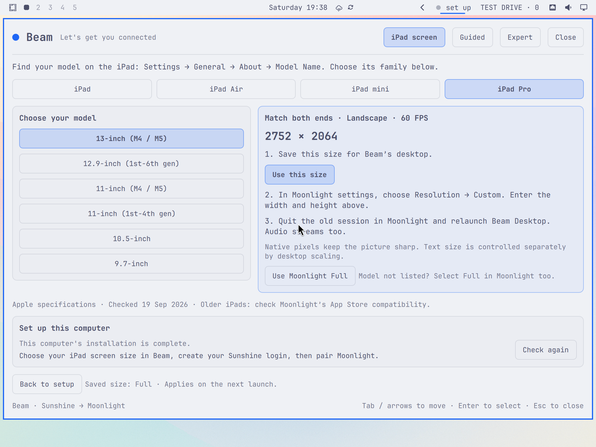

<p align="center">
  
</p>

<p align="center">
  <strong>Click the dot. Set up the stream. Take your desktop with you.</strong>
</p>

<p align="center">
  <a href="#get-started">Get started</a> ·
  <a href="#see-it-in-action">Screenshots</a> ·
  <a href="#six-steps-to-your-desktop">The walkthrough</a> ·
  <a href="#an-ipad-fit-for-an-ultrawide-desktop">iPad sizing</a> ·
  <a href="#built-and-checked">Verification</a>
</p>

Beam puts an Omarchy desktop-to-iPad setup flow right in your bar. It prepares
[**Sunshine**](https://github.com/LizardByte/Sunshine) on your computer, points you
to [**Moonlight**](https://moonlight-stream.org/) on your iPad, and keeps
the address, pairing page, and live checks together in one native panel.

**Development preview.** Clean installation, removal, layout, and awake-hold
checks have passed locally. Physical iPad pairing and streaming acceptance is
still in progress. [See exactly what has been tested.](docs/verification/README.md)

<p align="center">
  
</p>

## Small dot. Full control.

The desktop **and its sound** come through, including music playing on the host.
Video and desktop audio have been confirmed together on a physical iPad.

| Start from zero | Move like you know it |
| :--- | :--- |
| **Guided mode** breaks setup into six focused steps. Reopen Beam and land on the first unfinished one. | **Expert mode** puts status, connection details, both QR codes, and setup actions together. |
| **Scan the right app.** A QR code opens Moonlight's App Store page. A second holds your connection address. | **Read the real state.** See process count, startup, firewall, display, encoder, login, pairing, and stream status. |
| **Fit the iPad.** Moonlight supplies the requested size. Beam uses the exact requested pixels with readable scaling and restores the desktop afterward. | **Finish interrupted setup.** Repair handles the known Omarchy installer/service mismatch and duplicate startup paths. |

Every panel view is designed to fit **without scrolling**. Colors and fonts follow
your shell theme. QR codes keep their white background and quiet zone in both
dark and light themes.

## See it in action

**Expert mode: the whole connection at a glance.**

<picture>
  <source media="(prefers-color-scheme: dark)" srcset="docs/assets/beam-expert-dark.png">
  <source media="(prefers-color-scheme: light)" srcset="docs/assets/beam-expert-light.png">
  
</picture>

<p align="center">
  <a href="docs/assets/beam-expert-dark.png">View dark at full size</a> ·
  <a href="docs/assets/beam-expert-light.png">View light at full size</a>
</p>

**Guided mode: one clear next step.**

<p align="center">
  <a href="docs/assets/beam-guided.png"></a>
</p>

<sub>Native plugin captures from an isolated Omarchy VM at 1280×800. The displayed
address is a documentation fixture. The opening banner is conceptual artwork.</sub>

## Get started

Bring an **Omarchy session with a display**, an **iPad with a mouse and keyboard**,
and a network where the iPad can reach the computer. Bluetooth peripherals are
fine. Keep the desktop session unlocked.

Beam uses Omarchy's Quickshell plugin system and Python 3. Its setup action
installs Sunshine and `qrencode`. You install Moonlight on the iPad.

Install from GitHub:

```sh
omarchy plugin add https://github.com/nixfred/beam.git --enable
```

Choose a bar position when prompted. Then click the **set up** dot and let Beam
walk you through the rest. Package and firewall actions open a visible terminal
when needed, so you enter your computer password there.

<details>
<summary><strong>Developing from a local checkout?</strong></summary>

From the repository root, link Beam into your user plugin directory. These
commands assume that `nixfred.beam` has not already been installed there.

```sh
mkdir -p "$HOME/.config/omarchy/plugins"
ln -s "$PWD" "$HOME/.config/omarchy/plugins/nixfred.beam"
omarchy-shell shell rescanPlugins
omarchy plugin enable nixfred.beam --section right
```

If a code change stays cached after rescanning, use `omarchy restart shell`.

</details>

## Six steps to your desktop

| | In Beam | What you do |
| :---: | :--- | :--- |
| **01** | **What you need** | Get your iPad, mouse, and keyboard ready. |
| **02** | **This computer** | Run setup. Watch installation, ports, startup, process, and capture checks update. |
| **03** | **iPad app** | Scan the QR code for **Moonlight Game Streaming**. Open **iPad screen** and choose your model. |
| **04** | **Your login** | Create your Sunshine login on its local admin page. |
| **05** | **Connect** | Add this computer in Moonlight, then enter its PIN on the linked Sunshine PIN page. |
| **06** | **Watch** | Set Moonlight to the **Custom** dimensions Beam shows (or **Full** for automatic sizing), then launch **Beam Desktop**. |

The step rail works in both directions. Your current progress is checked live.
For repeat visits, switch to **Expert** for the address, QR codes, and PIN page.

Setup installs Sunshine directly and uses one desktop-session launcher. It no longer invokes the broken `sunshine.service` enable step. **Repair** still finishes older interrupted installs, fixes duplicate startup, and routes login and pairing links correctly. A failed package transaction stops setup with a retry instruction.

If Sunshine reports success creating your login, then shows **401 / Unauthorized**,
open **Admin** and sign in with that new Sunshine username and password. Admin
and PIN pages open in the same private browser session; keep that window open
for pairing. **Repair** also routes Sunshine's pairing notification and its
Sunshine Admin launcher to that session. This avoids extensions in the regular profile that can suppress
the login prompt, as reported in [Sunshine's troubleshooting discussion](https://github.com/orgs/LizardByte/discussions/788).

If the iPad says **Incorrect PIN** while Sunshine's web page says success,
start a fresh pairing attempt in Moonlight. Keep its PIN visible and enter those
exact four digits in Sunshine, including any leading zero. Wait for Moonlight
to confirm pairing. Sunshine 2026.516's web success means it accepted the PIN
submission, before the authenticated handshake finishes
([Sunshine source](https://github.com/LizardByte/Sunshine/blob/v2026.516.143833/src/nvhttp.cpp#L635-L680)).

Beam installs a Sunshine-only browser helper and backs up its original startup
file. The helper sends local Sunshine pages to the private session; other links
keep their normal browser behavior. Your global browser settings stay as they are.

## An iPad fit for an ultrawide desktop

A **5120×1440** desktop should not become a tiny panoramic strip on your iPad.
Beam's **Beam Desktop** app in Sunshine receives the width, height, and frame
rate requested by Moonlight before streaming begins.
Setup also adds the same sizing and recovery to Sunshine's unmodified **Desktop**
tile, so either desktop entry fits the client. Existing customized apps stay intact.
If updating an older Beam setup, quit the stream and run **Repair** once to enable
sizing on the default tile.

1. Open **iPad screen** in Beam. Find the model under **Settings → General → About → Model Name** on the iPad, select it, and click **Use this size**. Enter the same dimensions in **Moonlight → Settings → Resolution → Custom**, at **60 FPS**. For an unlisted model, choose **Use Moonlight Full** in Beam and **Full** in Moonlight.
2. Quit any existing stream, then open **Beam Desktop** or the stock **Desktop**
   tile. Resuming an old session does not rerun the sizing hooks.
3. Beam creates a desktop at the **exact requested pixels**, using a named
   Hyprland virtual display. It moves your desktop workspaces there and mirrors
   that picture on the local monitor. The physical panel keeps its supported mode.
4. Native iPad resolutions use **200% desktop scaling** when at least 960×640
   logical pixels remain. Text and controls stay readable while video retains
   native detail. Smaller requests use a lower scale.
5. Ending the stream returns the workspaces and original monitor layout.
   **Restore display** in Expert also recovers an interrupted session.

**[Find your iPad in the complete resolution guide](docs/ipad-resolutions.md).** The offline picker covers all 45 models in Apple’s identification list, grouped into 17 choices sharing 10 resolutions (verified 19 September 2026). It tells you exactly what to enter in Moonlight.



There is no single native resolution for every iPad. Apple’s current 13-inch
Pro is [2752×2064](https://www.apple.com/ipad-pro/specs/); other models differ.
At 200%, that gives a 1376×1032 workspace. A 2360×1640 iPad gets 1180×820.
The virtual display removes the physical monitor's resolution limit, so an
ultrawide monitor no longer forces a panoramic picture or a low-detail 4:3 fallback.

**Choose Full or a matching custom size on the iPad.** A 720p or fixed 16:9 request still produces
that shape and can leave borders. Beam reports the actual request and scale;
with a fixed desktop size, it keeps a mismatched request visible after disconnect.
It cannot identify a disconnected iPad or change Moonlight's saved setting.
The local ultrawide can show side borders while mirroring the iPad-shaped desktop.
The iPad stream is not stretched or cropped to hide an aspect-ratio mismatch.

Sunshine starts with Beam's capture display already present. Between streams,
that output holds an empty named workspace away from the physical screens.
Beam restores windows on disconnect, quit, a failed transition, or Sunshine exit.
A manual physical display change is preserved. If the original monitor is
unplugged, recovery stays saved until it is reconnected.

For multiple physical monitors, choose the source connector in Sunshine's
**Output Name**, then run **Repair**. Beam refuses an ambiguous choice.
Sunshine's Beam launcher captures the virtual output; customized app definitions
are preserved, but apps without Beam's hooks do not move their windows there.

Existing installations: quit the stream and run **Repair** once to enable native
sizing and update the stock Desktop tile. This replaces the earlier physical-mode
fallback. Keep the picture awake is enabled by default and releases afterward.

For an explicitly chosen stream size, the internal helper also supports
`bin/omarchy-beam set-resolution WIDTHxHEIGHT`. Custom sizes default to **100% scale**,
so a 1920×1440 custom size really provides a 1920×1440 desktop workspace.
Set the same dimensions in **Moonlight → Settings → Resolution → Custom** and
choose **60 FPS**, then quit the old stream and launch Desktop again.

**For a 4:3 iPad**, 1920×1440 at 100% is a middle ground between an oversized
720p desktop and tiny text on a 2560-pixel-wide workspace. Other iPad shapes need
a different height: check the dimensions shown by Full before choosing a custom
size. A 1920×1440 preset is not a universal border-free setting for every iPad.
For a **2732×2048 iPad**, keep the exact native picture and choose a middle-ground
workspace with an explicit scale:

```sh
bin/omarchy-beam set-resolution 2732x2048 1.3333333333333333
```

Select **2732×2048 at 60 FPS** in Moonlight, then quit and relaunch Desktop.
The host retains every native pixel and the exact screen shape, while about
**133% scaling** gives **2049×1536 logical workspace**. This makes controls
smaller than the automatic 200% setting without returning to a 16:9 desktop.
Invalid scales are rejected without changing the previous preference.

**Black borders on all four sides?** A 4:3 desktop inside a 1280×720 stream
gets side borders from Sunshine, then top and bottom borders when Moonlight
fits that 16:9 video onto the iPad. Changing only the host resolution cannot
fix both. Set the matching custom dimensions in Moonlight, quit the current
session, and launch Desktop again. Beam's sizing details show what Moonlight
actually requested, including the last mismatch after disconnect.

Use `bin/omarchy-beam set-resolution auto` to return to native client sizing
and automatic scaling.

## One dot tells the story

<p align="center">
  
</p>

The live dot pulses in your theme's accent color. Open Beam when it says
**check** to see the reason. The colors above are illustrative; the actual widget
uses your active theme.

## Your session, your settings

| Setting | Default | What it changes |
| :--- | :--- | :--- |
| **Keep this session awake** | On | Holds automatic idle during a detected stream. Manual locking still hides the desktop. |
| **Show the status beside the dot** | On | Shows `set up`, `iPad`, `live`, or `check` beside the bar indicator. |
| **Refresh interval** | 5 seconds | Sets regular status polling. Beam checks every 2 seconds while streaming or making changes. |

Beam leaves Sunshine login entry to Sunshine's own page and administrator
password entry to the visible terminal. It reports the encoder Sunshine actually
found instead of guessing from the graphics hardware.

Beam expects an already reachable network. Wi-Fi, routers, VPN access, and remote
network setup stay outside its scope. A tailnet address can be used when the iPad
already has access to that tailnet.

<details>
<summary><strong>Repair or remove a setup</strong></summary>

Open **Expert** to access **Install**, **Repair**, **Ports**, **Admin**, and the
**PIN page**. Results and recovery instructions appear in the panel.

**Remove** stops Sunshine and removes its package, default login and pairings,
startup entry, admin web app, and Omarchy-managed streaming firewall rules. Beam
asks for confirmation first. Any previously paired iPad will need to pair again.

To remove the Beam plugin itself:

```sh
omarchy plugin remove nixfred.beam
```

</details>

## Built and checked

| Verified locally | Evidence |
| :--- | :--- |
| **103 regression tests** | Ninety-six Python checks, including real Qt timeout and QR recovery tests, plus seven service-state checks. |
| **Independent Kimi3 and Grok audits** | Adversarial baseline probes, reviewed findings and fixes. [Audit reports and replay commands](docs/audits/2026-09-19/README.md). |
| **Clean VM install and removal** | One running Sunshine after install; zero processes and zero streaming rules after removal. |
| **No-scroll layouts** | All six guided steps, Expert, long errors, and confirmation at 1280×800; normal views on a 5120×1440 host. |
| **Dark and light QR codes** | Both codes decoded from captured screens with software. |
| **Awake-hold transitions** | A real Wayland idle observer responded to synthetic stream connect/disconnect events. |

Physical iPad pairing, desktop video, audio and a matching custom 2732×2048 picture are confirmed by the user. Post-stream readback confirms restoration to 5120×1440 at scale 1 with mirroring off. Camera scanning, input quality and Full/Safe Area requests remain separate physical acceptance checks. Read the [full verification report](docs/verification/README.md)
for methods, screenshots, and remaining checks.

<details>
<summary><strong>Run the development checks</strong></summary>

```sh
python -m unittest discover -s tests -p 'test_*.py' -v
node tests/service-state.test.js
omarchy-plugin-validate .
```

The QML provides the interface. `Service.qml` owns polling and the action queue;
the private backend owns system facts and setup actions. Its helper ships inside
the plugin and is not installed as a user command.

See the [product specification](PRD.md), [visual references](docs/style-reference.md),
and [asset notes](docs/assets/README.md). The `prototype/` directory is historical
reference; the root-level plugin is the current implementation.

</details>

---

<p align="center">
  Built for <strong>Omarchy</strong> · Streaming by <strong>Sunshine + Moonlight</strong><br>
  <sub>Beam by nixfred. Your desktop stays yours.</sub>
</p>
